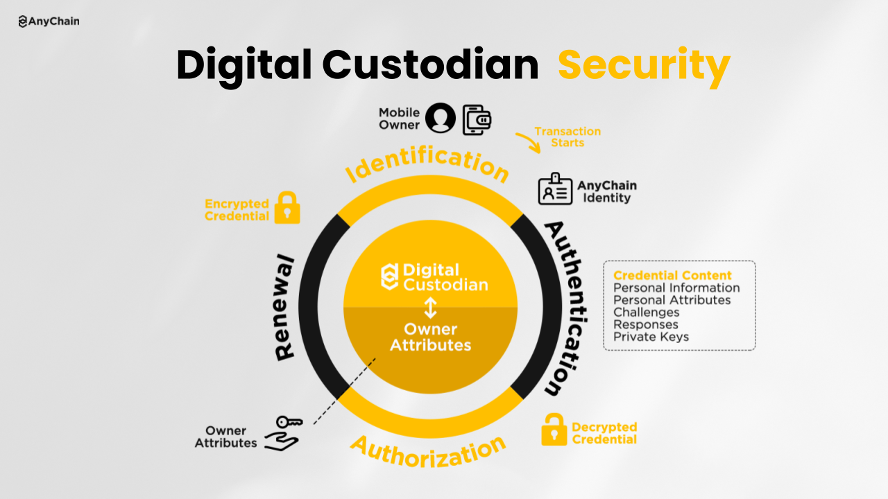
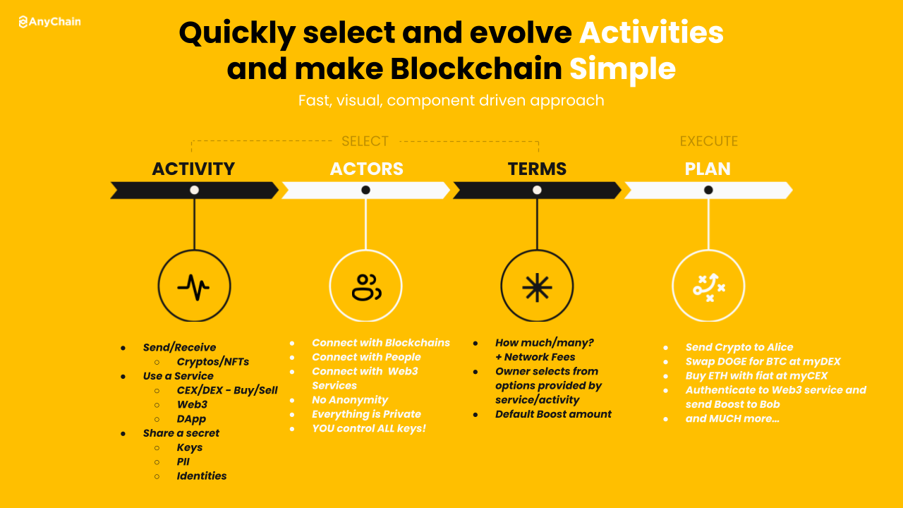

# AnyChain Digital Custodian Differentiators

AnyChain introduces some new ideas in order to drive security and simplicity for Owners. Protean Credentials are used to simplify authentication while creating a dynamic attack surface. A strong assertion of identity is central to AnyChain and is required for all interactions. Blocks contain Owner and Service profiles which are delivered over IPFS. Below we will examine each new idea in more detail.

Protean Credential

A Protean Credential entrusts the Owner with an encrypted payload on their device containing their unique data: challenge, hashed response, GUID for their unique Digital Custodian Identity (DCI), and private key for the DCI. ACC holds the private key required to decrypt the payload and perform the challenge/response to authenticate the Owner. After a successful authentication, ACC uses a new key pair to encrypt the credential data before sending it back to the owner and saving the new private key for the next authentication attempt. Once their DCI is started, the Owner controls a secondary Protean Credential that specifically controls access to their most significant protected data like private keys or credit card numbers. So what’s so “new” about this?

**Simplicity** – Owners create a single method to authenticate themselves. This can be based on any I/O their device supports including PIN, password, pattern, biometrics, and more.

**Security** – Protean Credentials are encrypted with a unique key pair that is changed after every use. So if someone gets a copy of an Owner’s credential they must successfully use it before the Owner does, otherwise the stolen credential becomes worthless.

**Control** – Operators of ACC environments will only be capable of starting and stopping an Owner’s DCI, only with the Owner’s explicit permission and with NO access to an Owner’s protected data.

**Figure 1:  Protean Credential**

# Identity Everywhere

Your Digital Custodian starts with an assertion of identity based on your AnyChain ID, which is globally unique, and used in the ephemeral DHT to locate your message slot and profile. The AnyChain ID is unique to a given DCI and is NOT the same as the GUID used by ACC to find and launch your DCI. Owners connect to other Owners using their AnyChain ID and the public message slot to ask for profile access. All communications for Digital Custodians are based on a “known connections” only policy described below.

**Public Profile** – Is an Owner’s online representation to the world. It is a specialized Block type that must contain some Owner details (e.g. first name, last initial, age, location, a public key, etc.) in a machine readable form and may also contain additional content like a static web page/site, audio, or even video. Access to Public Profiles is based on the age old premise of I’ll show you mine if you show me yours first. So an Owner who wants to view another Owner’s profile must first provide access to their profile to the other Owner. All Public Profile views are logged. Public Profile access requests and Connection Requests are the only public Digital Custodian messages allowed and Owners can create blocklists as needed.

**Connection Profile** – Once an Owner has accessed another Owner’s Public Profile they may request to make a connection. A Connection Request leverages Owners’ public keys in their Public Profiles to facilitate secure exchanges. If a connection request is accepted, a unique key exchange is performed between both Owners and they also share their default Connection Profiles. Every Owner has a default Connection Profile that shares additional details beyond their Public Profile. This might include an email address or user name/alias  for an external service they use. ACDC Owners can create unique Connection Profiles for every Connection Group they create.

**Known Connections Only** – ACDC is designed to limit communication to an Owner’s connections. All significant connection activity is logged and the connection’s unique details are available from their profiles. Every connection is placed in one or more groups and that group membership will determine what DC content they have access to.

**Contact Profile** – Our closest friends and those we trust should have access to our Contact Profile. This is another special form of Block that contains your contact details (e.g. full name, address, phone number, etc.). A connection may ask to become a contact. If a contact request is accepted then both Owner’s contact information will be automatically shared and updated when needed.

**Anonymity** – It is worth noting that AnyChain is not against anonymity online but ACDC is not designed to support it. We believe people should have a strong assertion of identity coupled with known good cryptography that they control for the best privacy and security. Malicious online trolling and bot activity both rely on the mask of anonymity so ACDC eschews that mask.

## Blocks and IPFS

Blocks in ACDC are encrypted, compressed files with manifests that describe the content. Blocks are meant to securely package up content for sharing with connections. Profiles are Blocks that can contain files (audio, video, etc.), static websites that reference ACDC activities, and properties/data that can be programmatically used. Every Block is secured using a key pair specific to the connection group the Block is shared with.

IPFS offers a peer to peer file system that is ideally suited for sharing Profile Blocks. In order to ensure privacy and security, ACDC only works with encrypted Blocks on IPFS by default.

# Core Principles

ACDC is guided by some core design principles. First and foremost, ACDC is about Owners and enriching their lives. Second, known good security primitives and practices should be implemented so Owners don’t even notice. We will explore these topics in more detail below.

##
    Built for Owners

ACDC has been designed so that a typical mobile user can be a successful Owner. Less technical Owners may use a managed service provider to host their ACDC and access ACC while more technical Owners may run their own DCI or even their own private ACC. Owners will need to pay for the computing resources their ACDC environments consume.

A mobile application is the primary UI for an Owner to simplify the Owner experience as much as possible. As a fail-safe measure, Owners may also enable a mobile responsive web interface if a mobile application is unavailable. ACC administrators may need OS/cluster level access but typical Owners will live in their mobile application.

To facilitate secure interactions, an Owner’s device is registered with their DCI upon enrollment and their mobile application will only communicate with their DCI. Once enrolled, the Owner’s device is the only entity allowed to interact with the Owner APIs. Any changes to the device fingerprint of the Owner’s device will lead to additional scrutiny from the DCI to validate and record the change.

All activity is driven based on events added to an Owner’s Queue. This queue helps drive automation, UI operations, direct communications, sharing content and more. Public and Private Message Slots for an Owner are shared via an ephemeral DHT that is updated every time a DCI starts. This approach makes service location simple and event handling efficient and robust.

## Managing Keys Doesn’t Need to be Messy

The most secure way to engage with other people online is based on a key exchange completely controlled by the two interested parties. The problem with this approach is the key management required once keys are exchanged. Typical online users will be challenged to securely collect and manage all of the keys they may need for interactions online. Additionally, key management best practices require periodic key rotations which makes this whole process difficult for a normal person.

ACDC and the DCI transparently consume, produce, and manage private keys on the Owner’s behalf. Every communication between Owners is encrypted with connection specific keys to ensure privacy. Key rotation is also regularly performed in order to maintain a protean attack surface. ACDC Owners gain the benefits of PKI without the complexity.

AnyChain Activities

AnyChain is tackling simplicity head on. While technically savvy owners can run their own ACC, AnyChain offers a hosted ACDC experience for the average person. Owners control all of their data, keys and communications while AnyChain simply provides the computing resources required to support their activities in the cloud. ACDC simplicity is also based on a mobile first, activity driven approach leveraging the cloud. ACDC owners select the activity, actors and terms for their transactions to create a plan that is executed based on their direction. Activities are easily combined into guides that implement best practices. Those “simple” online multi-step processes are turned into guides for common blockchain activities, creating guard rails for the average user.

## AnyChain Digital Custodian as your Secure Online Presence

The Digital Custodian is an evolutionary new idea. With ACDC, AnyChain wants to turn everyone into an Owner who commands their personal own economy and benefits from decentralization. Our vision is multifaceted and we have only covered the tip of the iceberg so far. The ACDC roadmap shared as part of the ACDC High-Level Design document provides more context on how AnyChain will evolve ACDC services based on Ownership Maturity.

## Join Us

AnyChain wants to spread economic prosperity through ownership but we can’t do it without your help. As an open source project we need developers, partnerships with blockchains and partnerships with exchanges to bring our vision to life. As a start up we need investment to keep the wheels turning. If you are interested in volunteering on the project, partnering with us or investing in the future of decentralized economics please email [info@anycha.in](mailto:info@anycha.in). Together we can build a future based on ownership and personal freedom.

