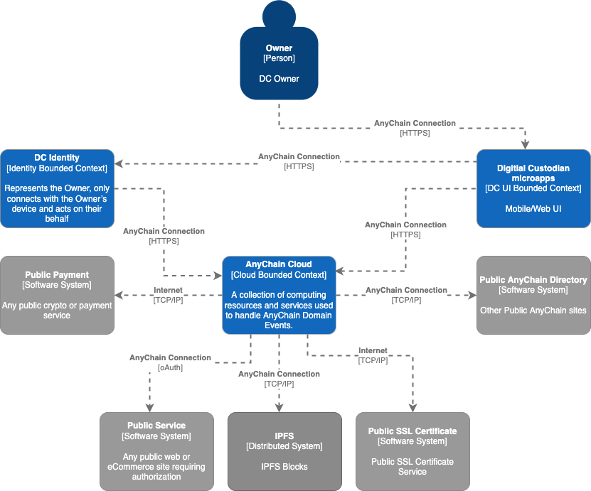
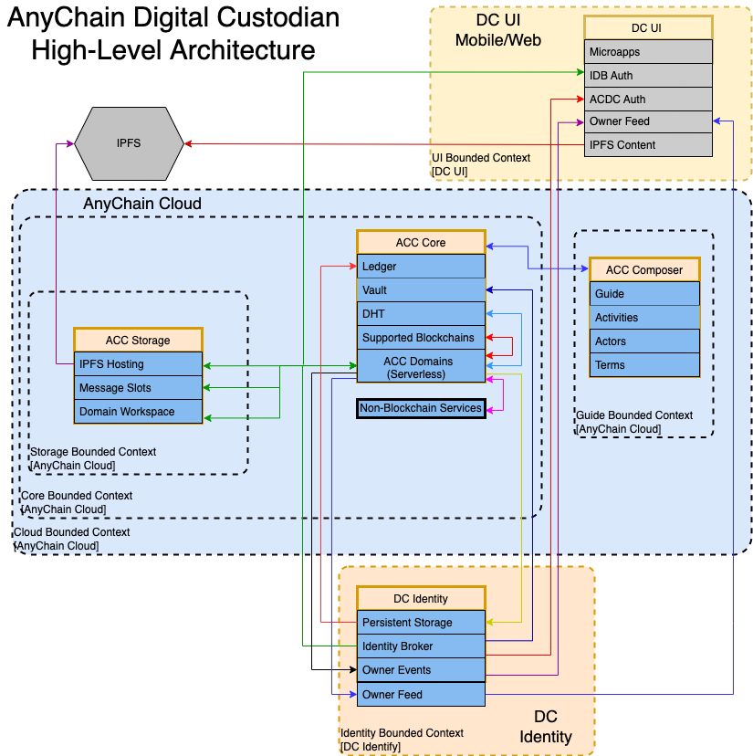
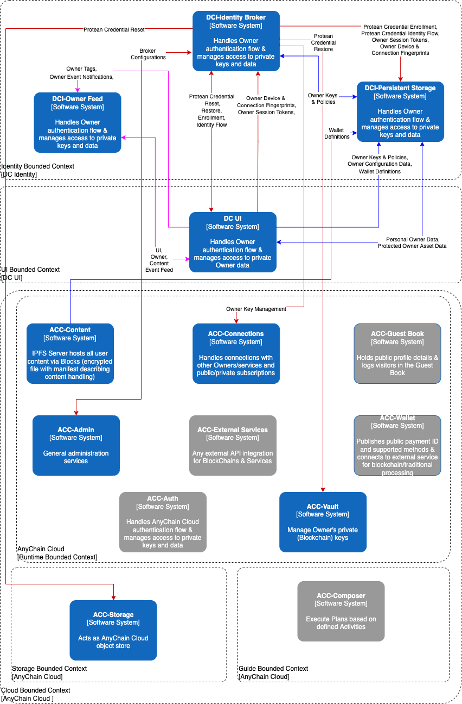
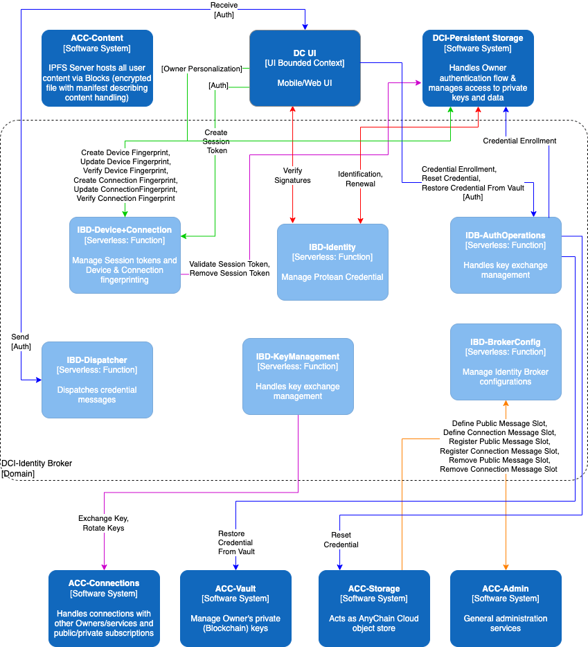

# ADC High-Level Design

AnyChain Digital Custodian (ADC) is designed as a decentralized and distributed system. ADC is meant to run in the cloud or on hardware owned and operated by the Owner. Every Owner could operate their own ADC environment with service locator data shared/replicated through a distributed hash table. Alternatively, Owners may pay someone like AnyChain to host their ADC environment where common services are provided for all paying Owners without compromising on control and ownership.

**Figure 1:  AnyChain Digital Custodian System Context**

ADC is a system that consists of 3 key components:

1. **_ Digital Custodian UI (DC UI)_** - The AnyChain mobile or web user interface is not monolithic. The frontend is to be implemented using autonomous microapps that are independently deployed. The objective of a micro frontend is to divide the user experience into a set of independent micro applications, while also providing users with a seamless experience. The main entry point will act as a metadata-driven assembly and menu system. This approach breaks the presentation tier into a set of independently deployable micro applications but stitches them back together for a seamless UX. As users move between different activities, it will not feel like they are jumping between applications. It feels like a single application.

    The **_DC UI _**app is the standard AnyChain microapps implementation and the Owner’s primary interface to ADC.  It is a mobile application with built-in core functionality for creating an ADC account, authenticating an Owner as required and securing/backing up critical private keys/data. The  also supports microapps that may be dynamically added as required to support desired functionality. Examples of microapps include an Owner’s feed, connections, owner personalization, and more.

2. **_AnyChain Cloud (ACC)_** - This is where most of the heavy lifting for ADC is performed. ACC includes advertising an Owner’s message slot location in a distributed hash table (DHT), serverless functions, blueprints for core functionality and blockchain nodes for desired operations. ACC is meant to be extensible as well, providing Owners with the ability to mesh new blockchains and other services with their other daily activities.
3. **_DC Identity (DCI)_** - The DCI is an Owner’s proxy online. It only connects to a single Owner’s mobile device via their DC UI and it performs operations in the cloud at the Owner’s direction. The DCI securely stores important Owner data so that it may be used during transactions and interactions as needed. This component may be operated as a container, VM, or physical appliance (e.g. installed on a Raspberry Pi or Atomic Pi) under the Owner’s direct control.

**Figure 2:  AnyChain Digital Custodian High-Level Design**

# ADC Owner

The DC UI is the Owner’s interface. It is a single place where an Owner can connect, communicate and transact with other Owners, blockchains and services. Core functionality like enrollment, authentication and administration make up the core of the DC UI, while other desired functionality is enabled dynamically using microapps.

**Figure 3:  DCI Identity Interactions**

DC Identity represents the Owner, only connects with the Owner’s device and acts on their behalf. The DCI drives automation on behalf of the Owner and prompts the Owner for authorization anytime digital secrets (e.g. private keys) are requested or required to perform an activity.

The ACC is how a single Owner’s DC UI and DCI connect with the rest of the world. This is where blockchains and other ADC services are deployed to support Owner’s activities. The goal for ACC is to provide serverless functions supporting activities (APIs) to operate or integrate with any blockchain or service the Owner desires.

Owner profiles are contained in blocks. Blocks are encrypted compressed archives that contain content and a manifest describing the contents for handling purposes. Blocks are shared with other Owners over IPFS

Owners have public profiles for discovering and connecting with other Owners. Public profiles are blocks shared over IPFS and contain data the Owner is willing to share publicly. This data includes a name, age, location and public key at a minimum. Owners may personalize their profiles and advertise additional content.

Owners wanting to communicate or transact must create a connection. The connection process creates a key exchange between the owners that is unique to the connection and regularly rotated. Connections are added to groups and group membership determines what profile is shared with the connection. Owners can create more detailed connection profiles to share more information with specific connections. Owners also have the option of sharing a contact block with specific connections creating an always up-to-date vCard.

Owners create wallets to control their digital assets. Public wallet addresses may be shared in profiles. Transactions are directly performed via any supported blockchain. Owners may keep their wallets hot (always available for automation) or frozen (stored in the AnyChain Safe Deposit Service).

As **Figure 4** below indicates, everything is event driven. Events are always encrypted based on unique key exchanges with other connected Owners or services. Every Owner has public and private message slots where they receive events. The location of an Owner’s public and private message slots are publicly and privately shared via an ephemeral distributed hash table. Events are stored in object storage and have a type which defines how they should be handled.

When an event is received in an Owner’s message slot, serverless functions operate on the event and add it to the Owner’s feed. The Owner’s feed is a time-series based event queue containing all significant events for the Owner. The Owner’s feed is a super set and encompasses ALL events. The UI feed is a subset of the Owner’s feed containing events defining the blocks needed to support the Owner’s activities (microapps) in the DC UI.

The AnyChain Safe Deposit Service ( SDS) offers Owners the ability to securely back up their critical keys and data contained in their Protean Credentials. Once an ACC administrator enables SDS access for the Owner, the Owner can elect to make a backup copy of their keys. To create a backup, the Owner authenticates their Protean Credential and creates a backup phrase unique to them. We recommend using song lyrics or movie quotes that are meaningful to you since most of us don’t perfectly memorize the words but will never forget our unique variations. The backup phrase is used to encrypt the Owner’s data and the resulting encrypted blob is stored in SDS secure storage. To restore a backup, the Owner must ask an ACC administrator for access to SDS, authenticate with their current credential, provide their backup phrase and then select the keys/data to be restored to their credential.

            **Figure 4:  DC UI-ACC-DCI  Interactions**

# ADC Project Roadmap

The ADC project roadmap is built around the 4 stages of ownership maturity as identified by AnyChain.

* **Phase 1**: Personal Ownership is about empowering people to organize, control and manage their personal digital secrets.
* **Phase 2: ** Community Ownership focuses on building group resources with shared ownership (e.g. multisig wallets).
* **Phase 3: **Merchant Ownership focuses on monetizing digital assets, physical goods and services.
* **Phase 4**: Builder Ownership is where an Owner can build new experiences that are integrated with ACC and deployable by other Owners.

Overall, the ADC roadmap is aligned with adding functionality to assist an Owner in growing their personal economy.

AnyChain has identified simple use cases that map to the stages of Ownership. These stages provide a general guide for prioritizing new functionality in upcoming releases. Each stage is built around a theme which should guide development. Stage 1 is all about helping an individual to get their digital life in order. With stage 2 ADC focuses on organizing and managing group interactions. The third stage is meant to support Owners who are building their business using ADC services. And the final stage is meant for Owners who have a vision or expertise they would like to share with others in order to deliver new experiences.

<table>
  <tr>
   <td colspan="4" ><strong>Ownership Maturity</strong>
   </td>
  </tr>
  <tr>
   <td><strong>Personal</strong>
   </td>
   <td><strong>Community</strong>
   </td>
   <td><strong>Merchant</strong>
   </td>
   <td><strong>Builder</strong>
   </td>
  </tr>
  <tr>
   <td>Manage personal digital assets (crypto, NFT, etc.)
   </td>
   <td>Create and manage shared identity
   </td>
   <td>Monetize digital assets, physical assets and services
   </td>
   <td>Integrate new blockchains (includes activities and guides)
   </td>
  </tr>
  <tr>
   <td>Create an online identity and connect with others.
   </td>
   <td>Manage group digital assets (multisig wallets)
   </td>
   <td>Manage delivery of purchases
   </td>
   <td>Offer new experiences to Owners with custom integrated services
   </td>
  </tr>
</table>
